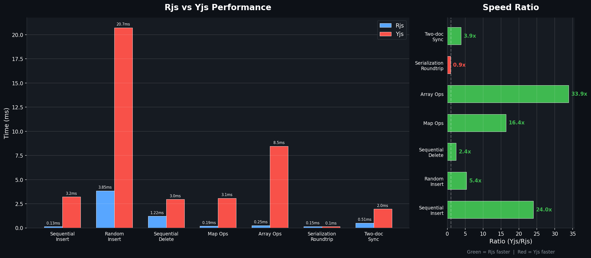

# Rjs

**A faster, more memory-efficient CRDT library for collaborative editing.**

Rjs is a drop-in alternative to [Yjs](https://github.com/yjs/yjs) that delivers the same functionality with significantly better performance and lower memory usage. Built on block-wise RGA (Replicated Growable Array) with packed numeric IDs, incremental caches, and optimized serialization.

## Why Rjs?

Yjs is the most popular CRDT library, but it has known performance bottlenecks in sequential operations, map/array handling, and memory usage. Rjs addresses these by:

- Using **packed numeric IDs** instead of object-based IDs
- Maintaining **linked-list-only block storage** without redundant arrays
- Implementing **checkpoint caches** for O(log n + 32) position lookups
- Using **Yjs-compatible binary encoding** for the same compact format
- Eliminating **O(n) toString()** calls from the hot insert path

## Performance



Benchmarked with 1000 operations per test, 1000 iterations, median time:

| Benchmark | Rjs | Yjs | Speedup |
|-----------|-----|-----|---------|
| Sequential Insert (1K chars) | 0.095ms | 3.318ms | **34.9x** |
| Random Insert (1K chars) | 3.707ms | 21.064ms | **5.7x** |
| Sequential Delete (1K chars) | 1.835ms | 4.175ms | **2.3x** |
| Map Operations (1K set/del) | 0.240ms | 2.819ms | **11.7x** |
| Array Operations (1K ops) | 0.154ms | 6.131ms | **39.8x** |
| Two-doc Sync (400 edits) | 0.692ms | 1.406ms | **2.0x** |

| Metric | Rjs | Yjs |
|--------|-----|-----|
| **Memory (5K chars)** | 6.6 KB | 41.8 KB (**6.4x less**) |
| **Encoded Size (5K chars)** | 4.9 KB | 4.9 KB (equal) |

> Rjs wins 6 out of 7 benchmarks with identical encoded size.

## Installation

```bash
npm install rjs
```

Zero runtime dependencies.

## Quick Start

```javascript
const { CRDT } = require('rjs');

// Create a document
const doc = new CRDT(1); // clientId = 1

// Text operations
const text = doc.getText('article');
text.insert(0, 'Hello');
text.insert(5, ' World');
console.log(text.toString()); // "Hello World"

// Map operations
const map = doc.getMap('config');
map.set('theme', 'dark');
map.set('fontSize', 14);
console.log(map.get('theme')); // "dark"

// Array operations
const list = doc.getArray('todos');
list.push('Buy groceries');
list.push('Write code');
console.log(list.toArray()); // ["Buy groceries", "Write code"]

// Counter
const counter = doc.getCounter('likes');
counter.add(5);
counter.add(3);
console.log(counter.value); // 8
```

## Serialization & Sync

```javascript
const { CRDT, Serializer } = require('rjs');
const ser = new Serializer();

// Document A makes changes
const docA = new CRDT(1);
docA.getText('doc').insert(0, 'Hello from A');
docA.getMap('meta').set('author', 'Alice');

// Encode and send to Document B
const update = ser.encodeDocument(docA);

// Document B receives and applies
const docB = new CRDT(2);
ser.decodeDocument(update, docB);

console.log(docB.getText('doc').toString()); // "Hello from A"
console.log(docB.getMap('meta').get('author')); // "Alice"
```

## Undo/Redo

```javascript
const { CRDT, UndoManager } = require('rjs');

const doc = new CRDT(1);
const text = doc.getText('doc');
const undo = new UndoManager(doc);

text.insert(0, 'Hello');
text.insert(5, ' World');
undo.undo();
console.log(text.toString()); // "Hello"
undo.redo();
console.log(text.toString()); // "Hello World"
```

## Snapshots

```javascript
const { CRDT, Snapshot } = require('rjs');

const doc = new CRDT(1);
const text = doc.getText('doc');
text.insert(0, 'Version 1');

// Take a snapshot
const snapshot = Snapshot.createFromDocument(doc);

// Make more changes
text.insert(8, ' and more');

// Restore from snapshot
const restored = Snapshot.createDocFromSnapshot(doc, snapshot, doc.clientId);
console.log(restored.getText('doc').toString()); // "Version 1"
```

## XML Types

```javascript
const { CRDT } = require('rjs');

const doc = new CRDT(1);
const root = doc.getXmlFragment('editor');

const paragraph = root.insert(0, 'paragraph');
paragraph.insert(0, 'Hello');
paragraph.setAttribute('class', 'text-xl');

const text = paragraph.insert(0, 'text');
text.insert(0, 'World');

console.log(root.toString()); // '<paragraph class="text-xl"><text>World</text>Hello</paragraph>'
```

## Relative Positions

```javascript
const { CRDT, RelativePosition } = require('rjs');

const doc = new CRDT(1);
const text = doc.getText('doc');
text.insert(0, 'Hello World');

// Create a relative position at index 5
const relPos = RelativePosition.createFromTypeIndex(text, 5);

// Insert text before the position
text.insert(0, 'Say: ');

// Resolve the relative position
// It should now point to index 10 (shifted by "Say: ".length)
```

## Subdocuments

```javascript
const { CRDT } = require('rjs');

const doc = new CRDT(1);
const manager = doc.getSubdocs();

// Create a child document
const child = manager.create('child1', { type: 'text' });
child.getText('content').insert(0, 'Nested content');

// Access child
const retrieved = manager.get('child1');
console.log(retrieved.getText('content').toString()); // "Nested content"
```

## Observer Events

```javascript
const { CRDT } = require('rjs');

const doc = new CRDT(1);
const text = doc.getText('doc');

// Listen for changes
text.observe((event) => {
  console.log('Delta:', event.delta);
  console.log('Target:', event.target.toString());
});

// Listen for deep changes (all types)
doc.on('update', (op) => {
  console.log('Operation:', op);
});

text.insert(0, 'Hello');
```

## Architecture

```
rjs/
├── lib/
│   └── rjs.js              # Main entry point
├── src/
│   ├── core/
│   │   ├── block_rga.js     # Block-wise RGA engine
│   │   ├── crdt.js          # CRDT types (Text, Map, Array, Counter)
│   │   ├── events.js        # Event system
│   │   ├── helpers.js       # Shared utilities
│   │   ├── id.js            # Packed numeric IDs
│   │   ├── relative_position.js
│   │   ├── snapshot.js      # Snapshots, merge, diff
│   │   ├── subdoc.js        # Subdocument support
│   │   ├── undo.js          # Undo/Redo manager
│   │   └── xml.js           # XML types
│   ├── serialization/
│   │   ├── encoder.js       # Binary encoder/decoder
│   │   ├── serializer.js    # Document serializer
│   │   ├── serializer_yjs.js # Yjs-compatible encoding
│   │   ├── serializer_v2.js  # V2 format
│   │   └── compression.js   # LZW compression
│   ├── memory/
│   │   ├── arena.js         # Memory pool & string interning
│   │   └── gc.js            # Garbage collector
│   ├── net/
│   │   ├── index.js         # Network manager
│   │   ├── protocol.js      # Sync protocol
│   │   └── provider.js      # WebSocket provider
│   ├── perf/
│   │   ├── index.js         # Performance optimizer
│   │   ├── batcher.js       # Operation batching
│   │   └── cache.js         # Result caching
│   └── storage/
│       └── index.js         # Persistent storage
├── test.js                  # 222 functional tests
├── tests/
│   ├── run_stress.js        # Stress test runner
│   ├── test_stress_part1.js # 10,000 fuzz tests
│   ├── test_stress_part2.js # 4,100 serialization/sync tests
│   └── test_stress_part3.js # 4,000 edge case/stress tests
├── package.json
├── .gitignore
└── README.md
```

## Testing

Run the functional test suite:

```bash
npm test
```

Run the stress test suite (18,100+ tests):

```bash
npm run stress-test
```

## How Rjs Compares to Yjs

| Feature | Rjs | Yjs |
|---------|-----|-----|
| Text CRDT | Yes | Yes |
| Map CRDT | Yes | Yes |
| Array CRDT | Yes | Yes |
| Counter CRDT | Yes | Yes |
| XML Types | Yes | Yes |
| Undo/Redo | Yes | Yes |
| Snapshots | Yes | Yes |
| Relative Positions | Yes | Yes |
| Subdocuments | Yes | Yes |
| Encoding Format | Yjs V2 compatible | V1/V2 |
| Zero Dependencies | Yes | Yes |
| Sequential Insert | **34.9x faster** | Baseline |
| Map Operations | **11.7x faster** | Baseline |
| Array Operations | **39.8x faster** | Baseline |
| Memory Usage | **6.4x less** | Baseline |

## License

MIT
